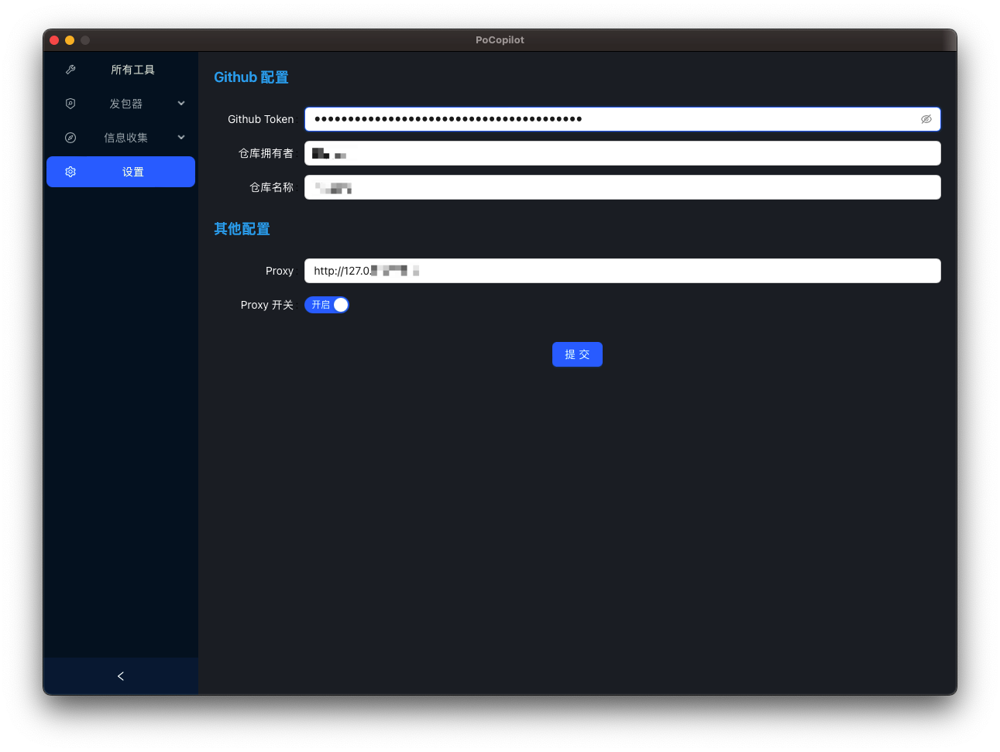

<div align="center">
  
  <h1>PoCopilot</h1>
  <p>PoCopilot is a toolkit designed to assist in the development of POCs by Wails + React.</p>
</div>


## 工具说明


### 1. 设置



日志及配置文件路径：

```
~/.pocopilot/
```


### 2. GithubAction

使用 GitHub Action 进行发包测试，请求发出为 Github Action，即微软机房。

* 配置：
  * 创建一个私人的 Github 仓库，并创建.github/workflows目录，将用户名及仓库名填入设置中。
  * 生成 Github Token，并填入设置中。


输入内容如下：

左侧 HTTP RAW 包，例如：

```http
GET / HTTP/1.1
Host: www.cip.cc
Upgrade-Insecure-Requests: 1
User-Agent: Mozilla/5.0 (Windows NT 10.0; Win64; x64) AppleWebKit/537.36 (KHTML, like Gecko) Chrome/91.0.4472.124 Safari/537.36
Accept: text/html,application/xhtml+xml,application/xml;q=0.9,image/avif,image/webp,image/apng,*/*;q=0.8,application/signed-exchange;v=b3;q=0.9
Accept-Encoding: gzip, deflate
Accept-Language: zh-CN,zh;q=0.9
Connection: close


```

右侧为目标站点列表，例如：

```text
http://www.cip.cc
https://www.baidu.com
```


### 3. GithubSearch

通过 Github 进行 POC 查询，检索后缀为 yaml 和 py 的文件，及相关所有的仓库。


点击文件名，可以查看详细 POC 内容


## 手动编译

v0.0.2

可参考 [Dockerfile](Dockerfile) 进行编译。

1. 安装 go 1.21 及以上版本
2. 安装 nodejs 16 及以上版本
3. 项目根目录执行下述命令：

```bash
npm install
go install github.com/wailsapp/wails/v2/cmd/wails@v2.8.1
wails build -upx
```
